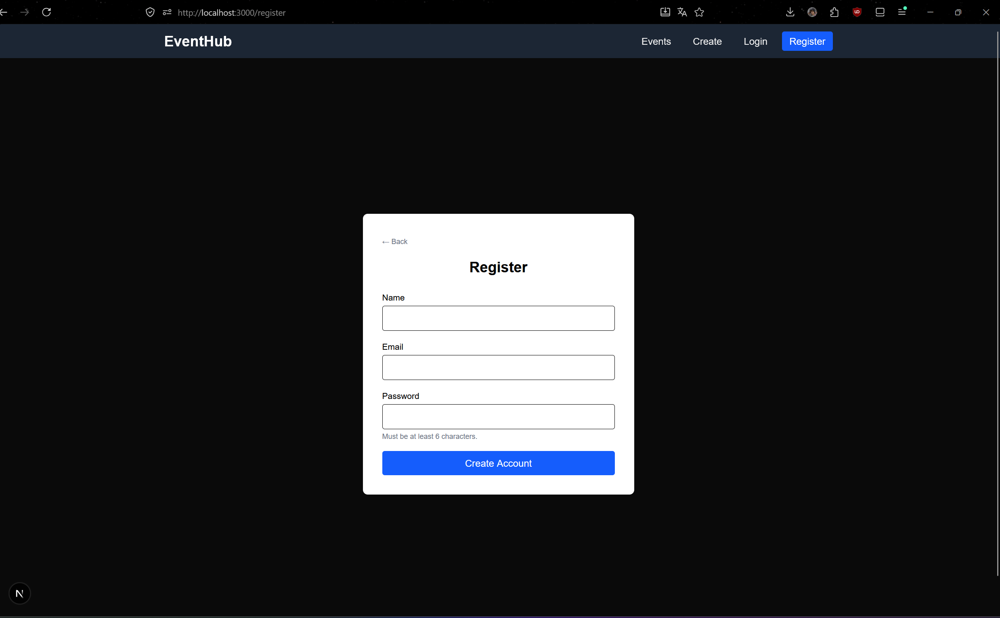
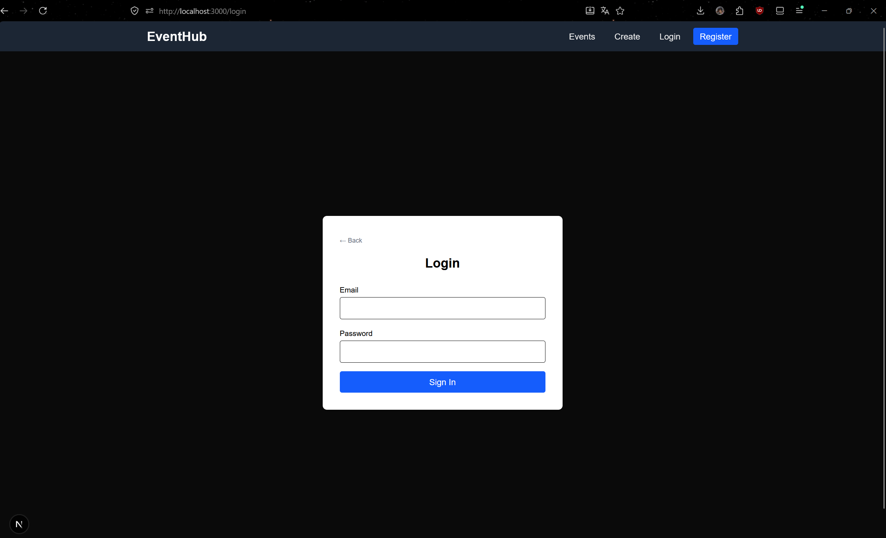
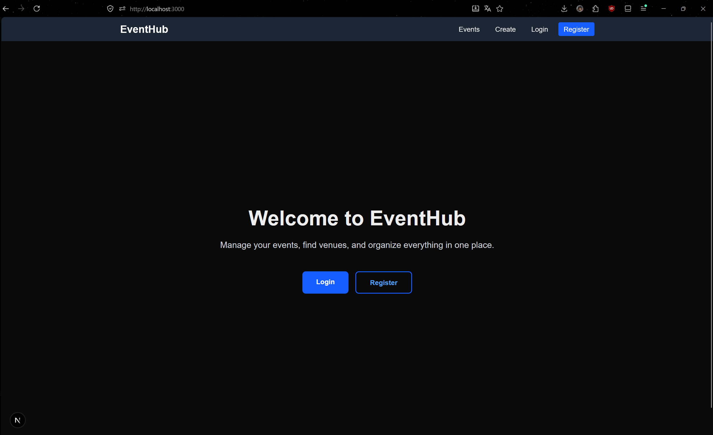
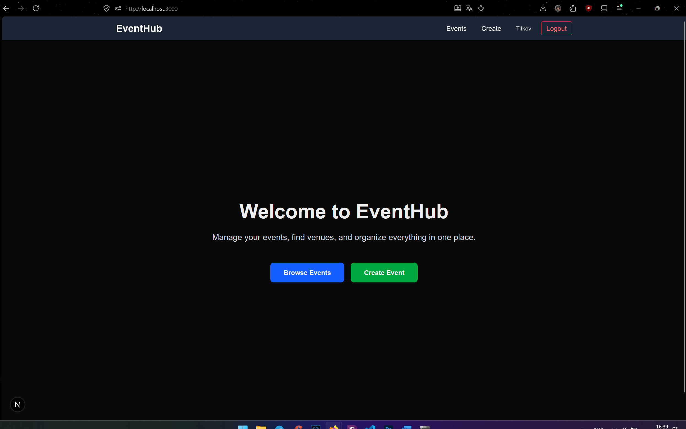
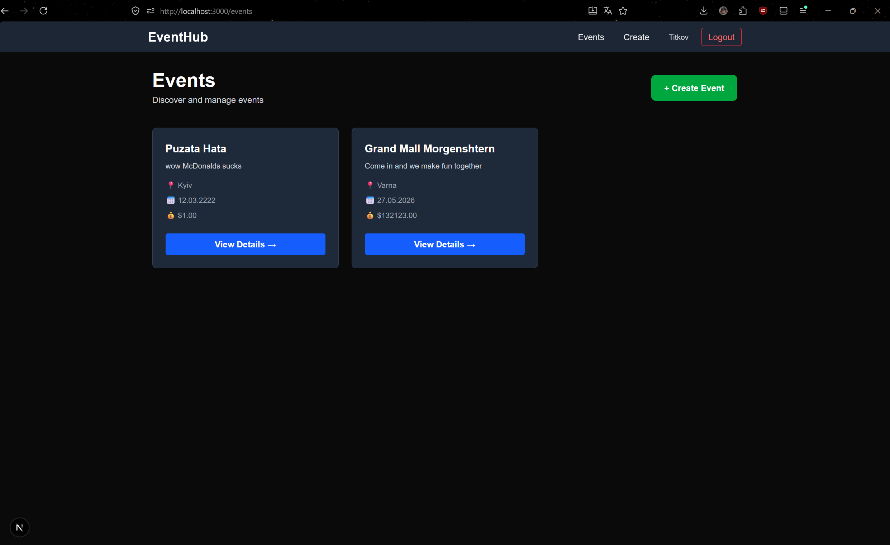
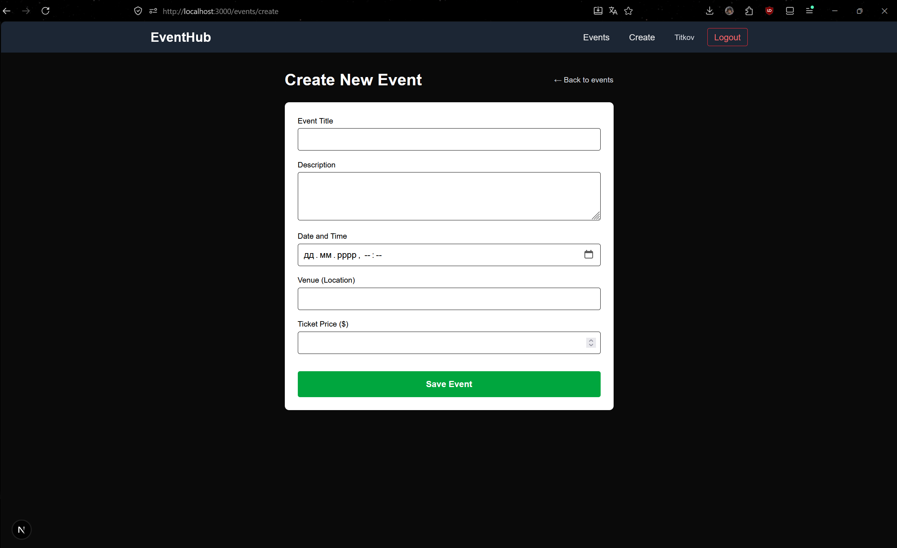
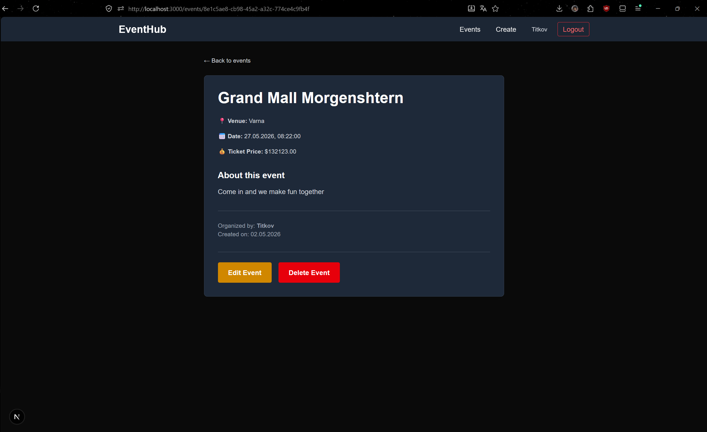
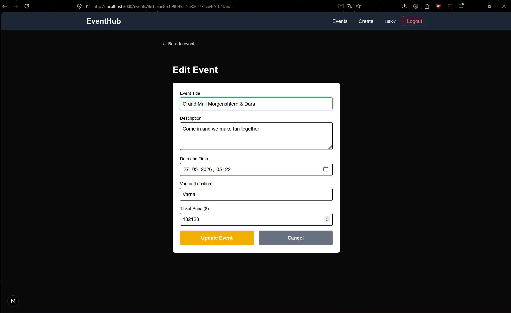
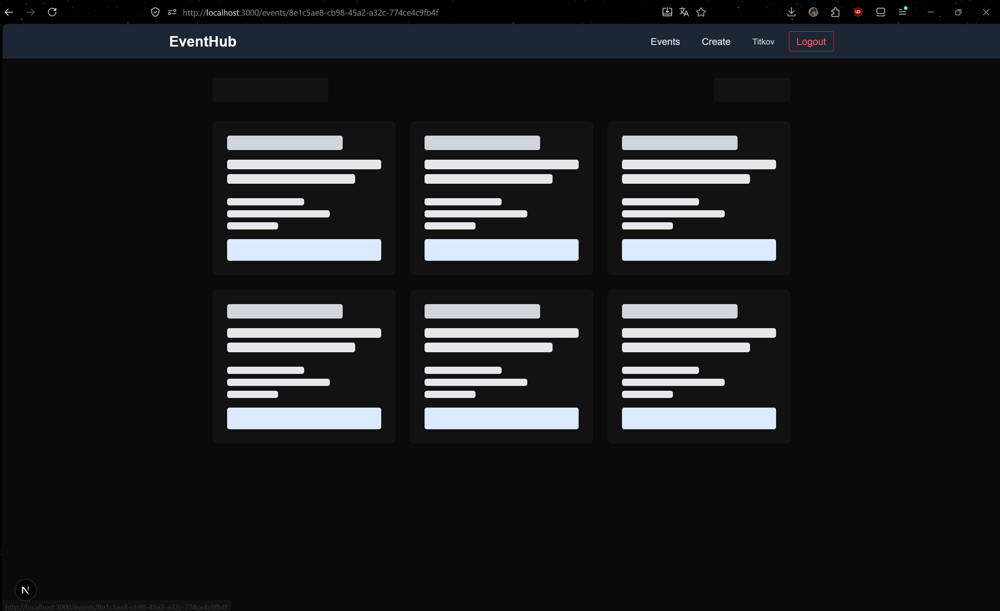

# Event Manager

A full-stack event management app built with Next.js and Prisma.

## What is this?

Event Manager lets users create and manage events. You can register an account, login, create events, view other people's events, edit or delete your own events. Only the person who created an event can edit or delete it.

## Tech Stack

- **Next.js** - full-stack framework
- **TypeScript** - type safety
- **Prisma** - database ORM
- **SQLite** - local database
- **NextAuth.js** - authentication
- **bcryptjs** - password hashing
- **Tailwind CSS** - styling

## How to Run

1. Install dependencies:
```bash
npm install
```

2. Create `.env` file in the root:
```env
DATABASE_URL="file:./dev.db"
NEXTAUTH_SECRET="your-secret-key"
```

3. Initialize database:
```bash
npx prisma migrate dev --name init
```

4. Start the dev server:
```bash
npm run dev
```

Open `http://localhost:3000` in your browser.

## How It Works

### Pages

- `/register` - Create new account (email must be unique, password is hashed)
- `/login` - Sign in with email and password
- `/` - Home page (different content for logged-in users)
- `/events` - List of all events (requires login)
- `/events/create` - Create new event (requires login)
- `/events/[id]` - View event details, edit/delete if you created it
- `/events/[id]/edit` - Edit event (only if you're the creator)

### Database Schema

Two models:
- **User** - stores email, hashed password, and created events
- **Event** - stores event data (title, description, date, venue, ticket price) with a reference to the creator

Only the user who created an event can edit or delete it.

### Authentication

- User registers with email and password
- Password is hashed with bcryptjs before saving
- NextAuth.js handles login sessions
- Protected routes check if user is logged in
- Edit/Delete endpoints verify the user owns the event

## Project Structure

```
src/
├── app/
│   ├── api/              # API endpoints
│   ├── login/            # Login page
│   ├── register/         # Register page
│   ├── events/           # Events pages
│   └── page.tsx          # Home page
├── lib/
│   └── prisma.ts         # Prisma client
prisma/
├── schema.prisma         # Database schema
└── migrations/           # Migrations
```

## Useful Commands

```bash
npm run dev              # Start dev server
npm run build            # Build for production
npm start                # Run production build
npx prisma studio       # Open Prisma Studio (view/edit DB)
npx prisma migrate reset # Reset database
```

## Notes

- SQLite is used for local development
- All passwords are hashed, never stored plain-text
- Users can only see events they created in full edit/delete mode
- Validation is done on both frontend and backend

## Screenshots












## Development Log & Problem Solving

**Overview:**
Building this full-stack Event Manager involved connecting a Next.js (App Router) frontend with a Prisma/SQLite backend and securing it with NextAuth.js. 

**Key Steps & Challenges Solved:**

**database Connection (Prisma + Fast Refresh):** 
   During early development, I encountered an issue where Next.js Fast Refresh would constantly create new instances of the Prisma Client, quickly exhausting the database connection limit. I solved this by implementing a singleton pattern for the Prisma client in `src/lib/prisma.ts` using `globalThis`, ensuring only one instance runs during development.

 **Authentication Flow & Security:** 
   I integrated NextAuth.js with a custom credentials provider. A key challenge was ensuring data security. I solved this by implementing `bcryptjs` in the `/api/register` route to hash passwords before saving them to the sqlite database and strictly validating email format on both the client and server sides.

**Enforcing the Ownership Rule:** 
   the assignment required that users can only edit or delete their own events.initially, I just create "Edit/Delete" buttons on the frontend. However, I realized this wasn't secure, as API endpoints could still be accessed directly. I fixed this by adding strict server-side validation in the `DELETE` and `PATCH` routes, comparing the active `session.user.id` against the `event.creatorId` from the database.

**UX and route protection:** 
   To prevent unauthenticated users from accessing protected pages like `/events/create`, I implemented a Next.js middleware. Additionally, to improve UX during data fetching, I utilized React Suspense by creating a `loading.tsx` file with skeleton loaders, keeping the server-side rendering architecture intact while preventing UI freezes.